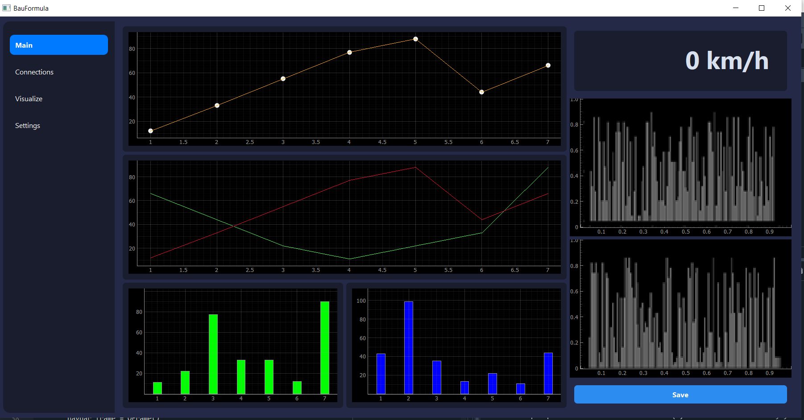
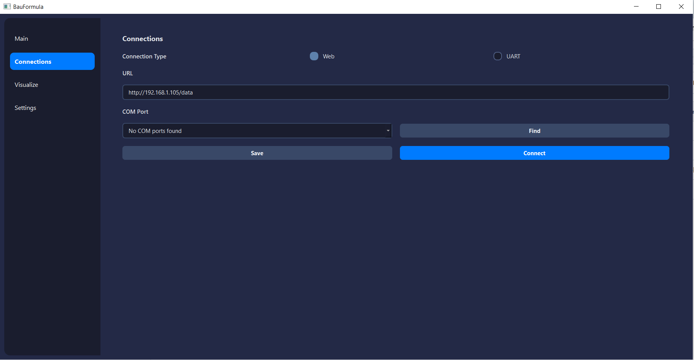
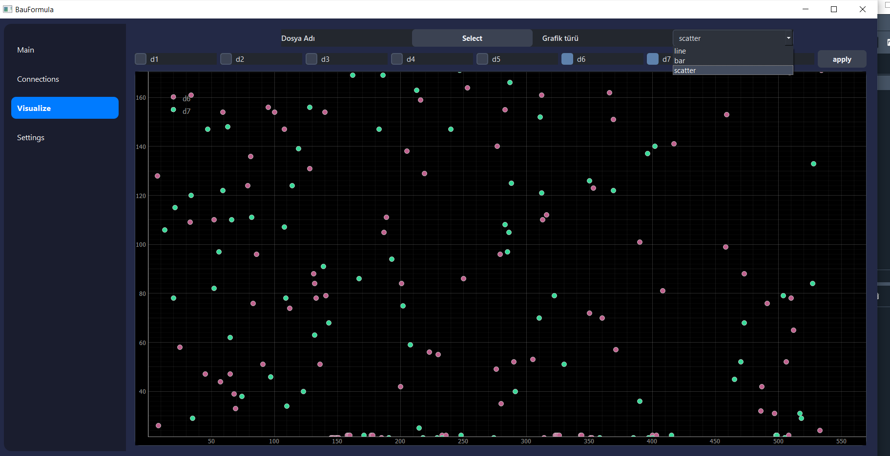

# 🏎️ BAUFormula  GUI

Bahçeşehir Üniversitesi Formula Takımı için geliştirilen, yarış aracı verilerini gerçek zamanlı izleyip analiz edebileceğiniz modern bir **telemetri arayüzü**.

---

## 🎯 Amaç

Bu proje, yarış sırasında araçtan gelen verileri:

- **Web üzerinden** (HTTP)
- **COM Portu üzerinden** (UART / Serial)

gerçek zamanlı olarak alıp, sezgisel grafiklerle sunmak için geliştirilmektedir.

---

## 🔍 Geçici Durum

Şu an için test amaçlı olarak:
- **Arduino** ve **ESP32** üzerinden sahte veriler gönderilmektedir.
- Gerçek sistemde hangi donanımlar kullanılacağı netleştikçe uyarlamalar yapılacaktır.

---

## 🧩 Geliştirme Planı

- [ ] Ayarlar penceresi
- [ ] Geçmiş verileri görselleştirme ekranı
---

##💻 Geliştirenler

BAUFormula  Yazılım Ekibi  
